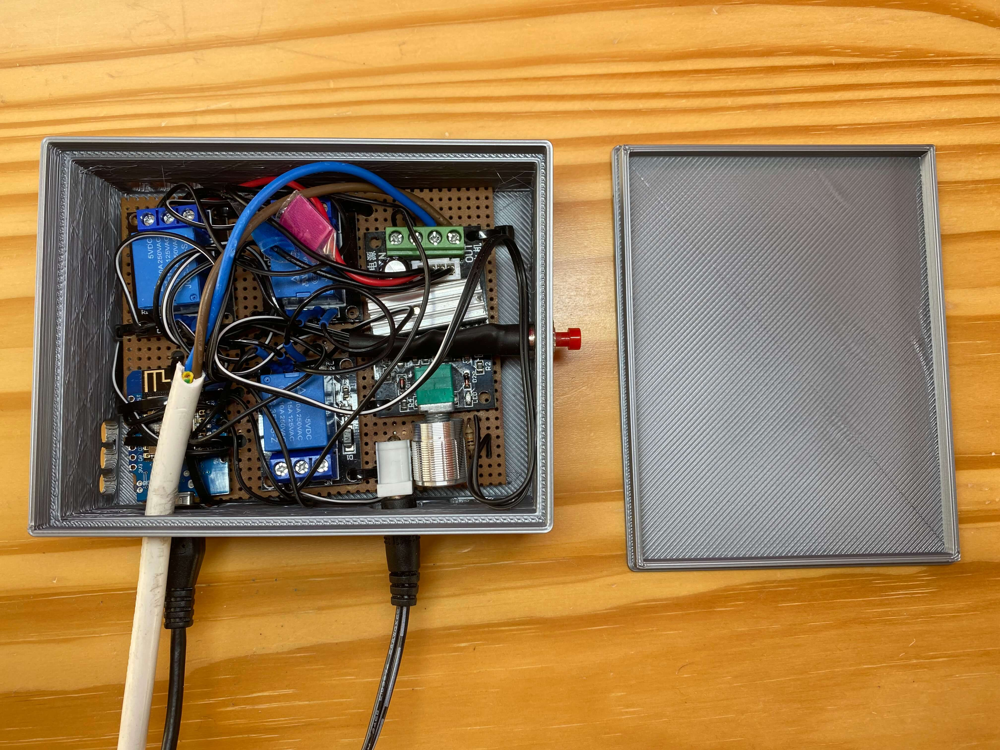
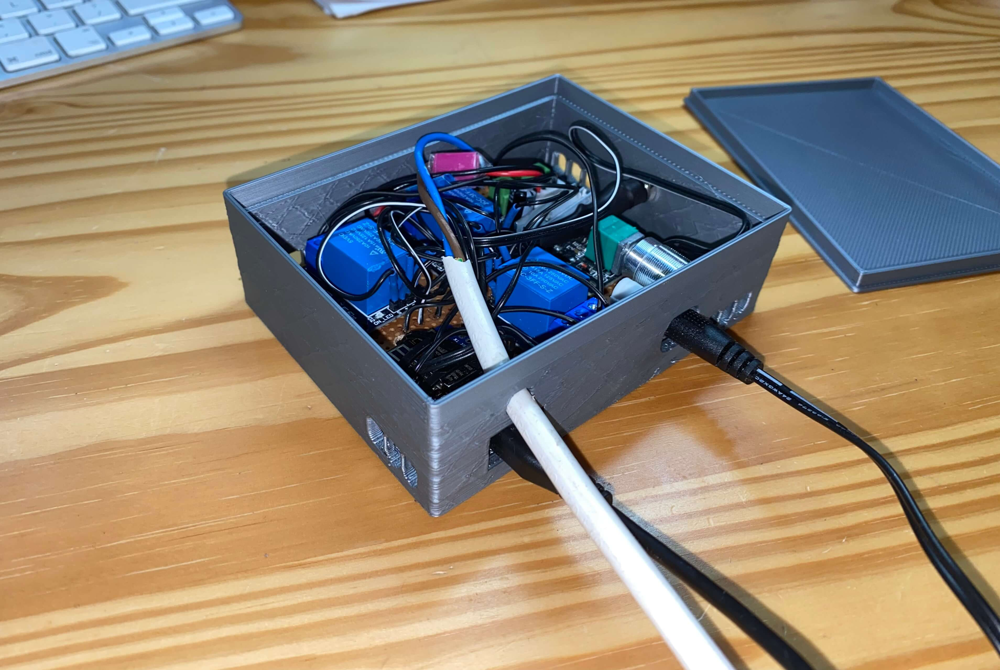
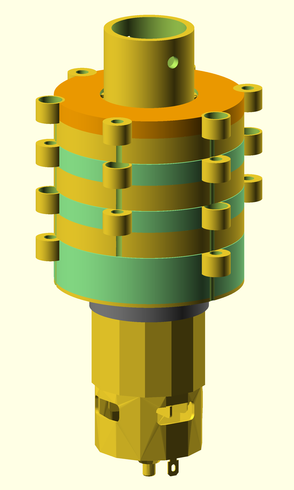
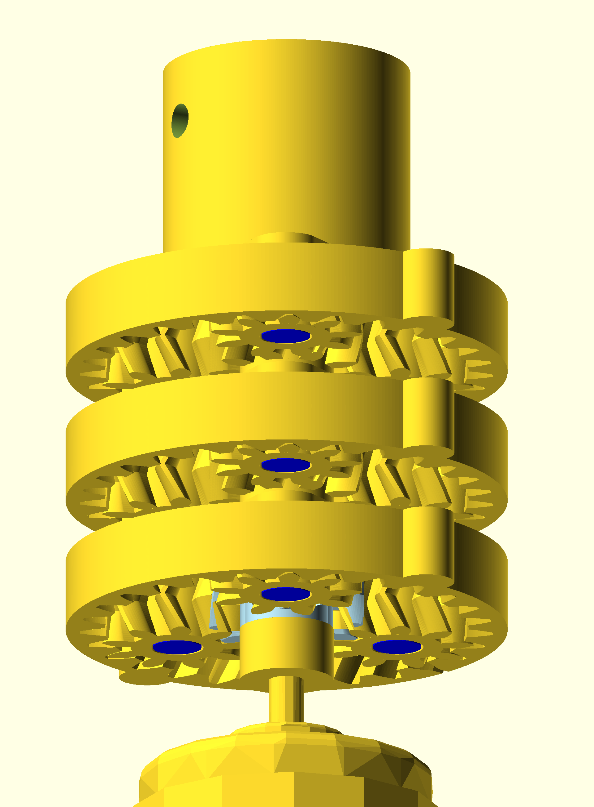

# Automatisches fernsteuerbares Rollo

### Zeitlupe vom Getriebe in Betrieb

Verantwortlich für die richtige Geschwindigkeits und Drehmoment Übersetzung des Motors.

	 <video width="250" controls>
	  <source src="gearbox_demo.mp4" type="video/mp4">
	Your browser does not support the video tag.
	</video>

### Beispiel Herunterfahren des Rollos

Später mit dünneren Stoff.

	 <video width="600" controls>
	  <source src="wind_down_example.mp4" type="video/mp4">
	Your browser does not support the video tag.
	</video>

### Steuerungseinheit

Schaltet Motor An/Aus, kontrolliert die Motor-Spannung/-Geschwindigkeit, wechselt Richtung des Motors, erlaubt Fernsteuerung per Handy, bremst Motor damit er im Ruhezustand nicht rückläuft (regenerative braking).

### Gearbox CAD (OpenSCAD)

Die Beschreibung der gesamten Einzelteile im Computer, um sie später mit dem 3D Drucker ausdrucken zu können. 

### Design-Ideen und Überlegungen
<a href="design_description.pdf">Zur PDF</a>
